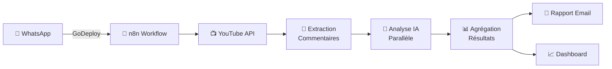

<div align="center">

# 🎥 YouTube MLOps Analysis Pipeline

### Analyse automatisée des commentaires YouTube avec IA

[](https://www.docker.com/)
[](https://www.python.org/)
[](https://n8n.io/)
[](https://huggingface.co/)

---

**Pipeline MLOps complet pour analyser les sentiments, émotions et toxicité des commentaires YouTube en temps réel**

Déclenchez l'analyse via WhatsApp • Recevez un rapport détaillé par email • Visualisez les résultats sur un dashboard interactif

</div>

---

## ✨ Fonctionnalités principales

<table>
<tr>
<td width="50%">

### 🚀 Déclenchement WhatsApp
Envoyez simplement `GoDeploy` via WhatsApp pour lancer l'analyse complète de votre chaîne YouTube

</td>
<td width="50%">

### 🤖 Analyse IA multimodale
4 modèles d'IA travaillent en parallèle pour une analyse complète : sentiment, émotions, toxicité, et classification personnalisée

</td>
</tr>
<tr>
<td width="50%">

### 📊 Reporting automatique
Rapport HTML détaillé envoyé par email avec statistiques, graphiques et recommandations

</td>
<td width="50%">

### 📈 Dashboard interactif
Visualisation en temps réel des résultats d'analyse avec Streamlit

</td>
</tr>
</table>

---

## 📸 Aperçu du projet


https://github.com/user-attachments/assets/c6a7fe3b-1104-4640-906d-b05dd7e8f21b


## 🎯 Comment ça marche ?



1. **Envoi de commande** : Un simple message WhatsApp déclenche tout le processus
2. **Extraction** : Récupération des vidéos récentes et de leurs commentaires
3. **Analyse IA** : 4 modèles analysent en parallèle les sentiments, émotions et toxicité
4. **Rapport** : Génération et envoi automatique d'un rapport détaillé
5. **Visualisation** : Mise à jour du dashboard avec les nouveaux résultats

---

## 🏗️ Architecture technique

<div align="center">

```
┌─────────────────────────────────────────────────────────────────┐
│                         SERVICES DOCKER                          │
├──────────────┬──────────────┬──────────────┬───────────────────┤
│     n8n      │  PostgreSQL  │  MCP Server  │  Streamlit App    │
│   (5678)     │    (5432)    │    (8000)    │      (8501)       │
└──────┬───────┴──────┬───────┴──────┬───────┴────────┬──────────┘
       │              │              │                │
       │              │              │                │
       v              v              v                v
┌──────────────────────────────────────────────────────────────────┐
│                        INTÉGRATIONS API                           │
├─────────────┬─────────────┬─────────────┬──────────────────────┤
│  YouTube    │  Hugging    │   Twilio    │       Gmail          │
│  Data API   │    Face     │  WhatsApp   │       SMTP           │
└─────────────┴─────────────┴─────────────┴──────────────────────┘
```

</div>

### Stack technologique

| Catégorie | Technologies |
|-----------|-------------|
| **Orchestration** | n8n, Docker, Docker Compose |
| **Backend** | FastAPI, Python 3.9+ |
| **IA/ML** | Transformers (Hugging Face), PyTorch |
| **Base de données** | PostgreSQL 13 |
| **Visualisation** | Streamlit, Matplotlib, Seaborn |
| **APIs** | YouTube Data v3, Twilio, Gmail SMTP |
| **Networking** | ngrok (exposition webhook) |

---

## 🚀 Installation rapide

### Prérequis

- Docker & Docker Compose
- Compte Twilio (sandbox WhatsApp)
- Clé API YouTube Data v3
- Compte Gmail avec app password

### Installation en 3 commandes

```bash
# 1. Cloner et configurer
git clone https://github.com/votre-username/youtube-mlops-n8n.git
cd youtube-mlops-n8n
cp .env.example .env  # Puis éditer avec vos clés

# 2. Démarrer les services
docker-compose up -d

# 3. Configurer ngrok (dans un nouveau terminal)
ngrok http 5678
```

📖 **[Guide d'installation détaillé →](QUICK_START.md)**

---

## 💡 Utilisation

### Méthode 1 : Via WhatsApp (Recommandé)

1. Rejoindre le sandbox Twilio : Envoyer `join <code>` au +1-415-523-8886
2. Envoyer : `GoDeploy`
3. Attendre 2-5 minutes
4. Vérifier votre email ! 📬

### Méthode 2 : Via interface n8n

1. Ouvrir http://localhost:5678
2. Ouvrir le workflow "YouTube MLOps Pipeline"
3. Cliquer sur "Execute Workflow"

### Méthode 3 : Via API

```bash
curl -X POST http://localhost:5678/webhook/your-webhook-id \
  -H "Content-Type: application/json" \
  -d '{"message": "GoDeploy"}'
```

---

## 📊 Exemple de résultats

Le rapport d'analyse contient :

<table>
<tr>
<td width="25%" align="center">
<b>😊 Sentiments</b><br/>
Distribution<br/>
Positif/Neutre/Négatif
</td>
<td width="25%" align="center">
<b>🎭 Émotions</b><br/>
Joie, Tristesse,<br/>
Colère, Surprise
</td>
<td width="25%" align="center">
<b>⚠️ Toxicité</b><br/>
Détection de<br/>
commentaires toxiques
</td>
<td width="25%" align="center">
<b>🏆 Top commentaires</b><br/>
Meilleurs commentaires<br/>
par popularité
</td>
</tr>
</table>

**Exemple de métrics :**
- ✅ Temps d'analyse : ~2-3 minutes
- ✅ Commentaires analysés : 20 par vidéo
- ✅ Précision des modèles : >85%
- ✅ Taux de détection toxicité : >90%

---

## 🎨 Modèles IA utilisés

| Modèle | Tâche | Provider |
|--------|-------|----------|
| `bert-base-multilingual-uncased-sentiment` | Analyse de sentiment (1-5 étoiles) | Hugging Face |
| `distilbert-base-uncased-emotion` | Détection d'émotions (6 classes) | Hugging Face |
| `toxic-bert` | Détection de toxicité | Hugging Face |
| `MCP Custom` | Classification multi-catégories | Serveur local |

---

## 🔧 Configuration avancée

<details>
<summary><b>Variables d'environnement</b></summary>

```bash
# YouTube
YOUTUBE_API_KEY=your_key_here
MAX_VIDEOS_TO_ANALYZE=5
MAX_COMMENTS_PER_VIDEO=20

# Gmail
GMAIL_EMAIL=your_email@gmail.com
GMAIL_APP_PASSWORD=your_app_password

# Hugging Face (optionnel)
HUGGINGFACE_API_KEY=your_hf_token

# n8n
N8N_ENCRYPTION_KEY=random_string_min_10_chars
```

[Voir toutes les variables →](.env.example)

</details>

<details>
<summary><b>Personnalisation du workflow</b></summary>

Vous pouvez modifier :
- Le nombre de commentaires analysés
- Les critères de sélection (popularité, récence)
- Les modèles IA utilisés
- Le format du rapport
- Les destinataires des notifications

</details>

<details>
<summary><b>Ajout de nouveaux modèles IA</b></summary>

1. Choisir un modèle sur [Hugging Face](https://huggingface.co/models)
2. Ajouter un nœud HTTP Request dans n8n
3. Configurer l'endpoint : `https://api-inference.huggingface.co/models/{model-name}`
4. Ajouter votre token HF dans les headers

</details>

---


## 🗺️ Roadmap

- [x] Analyse de sentiment multilingue
- [x] Détection d'émotions et toxicité
- [x] Intégration WhatsApp
- [x] Dashboard Streamlit
- [ ] Analyse temporelle des tendances
- [ ] Fine-tuning des modèles
- [ ] Support multi-chaînes
- [ ] Réponses automatisées
- [ ] API REST publique
- [ ] Intégration Slack/Discord

---


**⭐ Si ce projet vous intéresse, n'hésitez pas à mettre une étoile sur GitHub ! ⭐**

